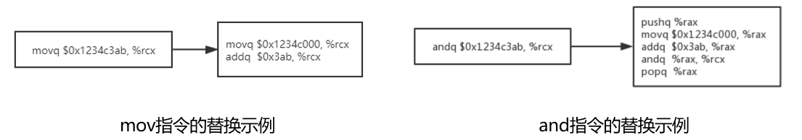

# 0. 文件说明

angr-scripts

​	|_ instructionTest.py: rop防御的实现代码

​	|_ reassembler.py：二次汇编框架源码，里面带有l1b0的注释即为添加的代码

​	|_ utils.py：intel转att

tests

​	|_ asm2hex_att.py: at&t格式的汇编代码转16进制

​	|_ asm2hex_intel.py：intel格式的汇编代码转16进制

​	|_ checksec.sh：checksec工具的源码

​	|_ test_ramblr.py：调用二次汇编框架的主要代码，包含本文实现方法的调用接口。

# 1. 系统架构

本文设计了一种基于二次汇编的ROP攻击防御方法，对二进制文件进行静态二进制重写，避免了需要程序源码的问题。从减少gadgets数量和保护控制流的完整性两个维度出发，使用指令替换、无效指令填充以及自由跳转保护三种方法对ROP攻击进行缓解和防御。

本文实现的ROP攻击防御系统的流程如下图所示，二次汇编框架在接收到二进制文件后，首先对其进行控制流恢复、内容分类和符号化等一系列操作，然后在进行重汇编时，通过在源码中添加接口可以获取到二进制文件中分别以函数、基本块和指令为单位的数据。在此过程中，本系统对这些数据进行处理，其中指令替换和无效指令填充以指令为一个基本单位进行，自由跳转保护以函数为一个基本单位进行。当重汇编结束后，本系统进行最后一个步骤即重编译，将重汇编得到的输出保存为汇编文件并对其进行编译，得到新的二进制文件。

# 2. 设计原理

## 2.1 指令替换

模块流程图

可能被解析为ret指令的机器码有0xc2,c3,ca和cb。

基于立即数划分的替换，支持mov、add、sub、cmp、and、or和xor共七种指令

基于中转寄存器的替换

## 2.2 无效指令填充

原理

实现

## 2.3 自由跳转保护

函数入口处将返回地址与canary加密，ret前解密，间接跳转（jmp eax）前校验是否加密。

入口处加密如下图，解密类似，校验加密的代码是防止重复加密。

间接跳转前

由于本文仅对可执行文件中的函数进行返回地址保护，当可执行文件在执行过程中控制流直接跳转到系统调用函数时，返回地址是经过加密的，而系统调用函数中没有对返回地址进行解密，导致控制流返回到一个错误的地址，程序执行崩溃。所以对于操作数的数值位于text段以外的直接跳转指令，本文在该指令前对返回地址是否加密进行校验，若返回地址经过加密则对其进行解密操作，以防止程序执行崩溃。

# 3. 测试结果

## 3.0 测试环境

操作系统：ubuntu 16.04

测试用例：coreutils工具包，含有栈溢出漏洞的程序，均不开启pie和canary保护，64-bit

## 3.1 性能测试

表1 ROP保护对二进制文件大小的影响

| 可执行文件名及版本 | 文件大小（KB） | 文件大小（KB）   | 文件大小（KB）  | 变化率 | 变化率 |
| ------------------ | -------------- | ---------------- | --------------- | ------ | ------ |
|                    | 原文件（S1）   | 二次汇编后（S2） | ROP保护后（S3） | S3/S2  | S3/S1  |
| md5sum 8.21        | 173.8          | 65.9             | 73.9            | 112.1% | 42.5%  |
| chmod 8.21         | 252.4          | 109.4            | 113.4           | 103.7% | 44.9%  |
| df 8.21            | 473.6          | 195.3            | 203.3           | 104.1% | 42.9%  |
| dir 8.21           | 516.0          | 219.9            | 235.9           | 107.3% | 45.7%  |
| mkdir 8.21         | 241.8          | 95.3             | 99.3            | 104.2% | 44.1%  |
| base64 8.21        | 157.1          | 65.0             | 69.0            | 106.2% | 43.9%  |
| diff 3.2           | 531.5          | 249.8            | 261.8           | 104.8% | 49.3%  |
| gzip 1.10          | 326.5          | 182.1            | 190.1           | 104.4% | 58.2%  |
| 平均值             |                |                  |                 | 105.9% | 46.4%  |

表2 ROP保护对二进制文件执行时的时间开销影响

| 可执行文件名及版本 | 执行的任务                | 所需的时间（s） | 所需的时间（s） | 变化率  (T2-T1)/T1 |
| ------------------ | ------------------------- | --------------- | --------------- | ------------------ |
|                    |                           | 原文件（T1）    | ROP保护后（T2） |                    |
| md5sum 8.21        | 计算2GB大小文件的md5值    | 4.78            | 4.70            | -1.6%              |
| diff 3.2           | 比较两个2GB大小的文件差异 | 87.05           | 88.17           | 1.3%               |
| base64 8.21        | 计算2GB大小文件的base64   | 27.57           | 27.88           | 1.1%               |
| gzip 1.10          | 压缩2GB大小的文件         | 65.22           | 70.86           | 8.6%               |
| gzip 1.10          | 解压原始大小为2GB的压缩包 | 18.90           | 19.14           | 1.3%               |
| 平均值             |                           |                 |                 | 2.1%               |

## 3.2 gadgets数量测试

通过ROPgadget自动化搜索工具获取。

表3 ROP保护对二进制文件中gadgets数量的影响

| 可执行文件名及版本 | gadgets数量  | gadgets数量      | gadgets数量     | 变化率 | 变化率 |
| ------------------ | ------------ | ---------------- | --------------- | ------ | ------ |
|                    | 原文件（N1） | 二次汇编后（N2） | ROP保护后（N3） | N2/N1  | N3/N1  |
| md5sum 8.21        | 473          | 440              | 159             | 93.0%  | 33.6%  |
| chmod 8.21         | 825          | 770              | 447             | 93.3%  | 54.2%  |
| df 8.21            | 1070         | 985              | 399             | 92.1%  | 37.3%  |
| dir 8.21           | 1266         | 1172             | 622             | 92.6%  | 49.1%  |
| mkdir 8.21         | 665          | 540              | 253             | 81.2%  | 38.0%  |
| base64 8.21        | 408          | 340              | 111             | 83.3%  | 27.2%  |
| diff 3.2           | 1251         | 1203             | 425             | 96.2%  | 34.0%  |
| gzip 1.10          | 889          | 829              | 282             | 93.3%% | 31.7%  |
| 平均值             |              |                  |                 | 90.6%  | 38.1%  |

## 3.3 ROP防御效果测试

